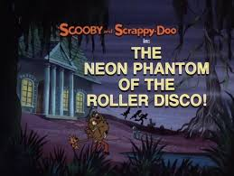
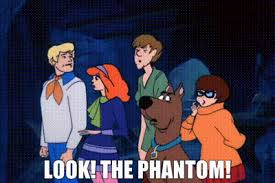

# Video Links  

>

local video test (mp4)

<!---
<video controls="" autoplay="" name="media"><source src="./eraserhead_2.mp4" type="video/mp4">
</video>

<video width="320" height="240" controls>
  <source src="file:///D:/Users/TDogg/Desktop/Vue_Projects/worknotes/docs/eraserhead_2.mp4" type="video/mp4">
</video>
-->

<video width="560" height="315" controls>
  <source src="../assets/eraserhead_2.mp4" type="video/mp4">
</video>

embedded YouTube test 

<iframe width="560" height="315" src="https://www.youtube.com/embed/_XzGhc9mPVk" title="YouTube video player" frameborder="0" allow="accelerometer; autoplay; clipboard-write; encrypted-media; gyroscope; picture-in-picture" allowfullscreen></iframe>

 

**Zoiks!** 

Download a Youtube video : [Y2mate](https://y2mate.tools/en57gc)

<!--
<html> 
<body>

 
  <button onclick="playPause()">Play/Pause</button> 
  <button onclick="makeBig()">Big</button>
  <button onclick="makeSmall()">Small</button>
  <button onclick="makeNormal()">Normal</button>
    
  <video id="video1" width="420">
    <source src=".\eraserhead_2.mp4" type="video/mp4">
//    <source src="mov_bbb.ogg" type="video/ogg">
    Your browser does not support HTML video.
  </video>

 

 

-->

<!-- 

-->

